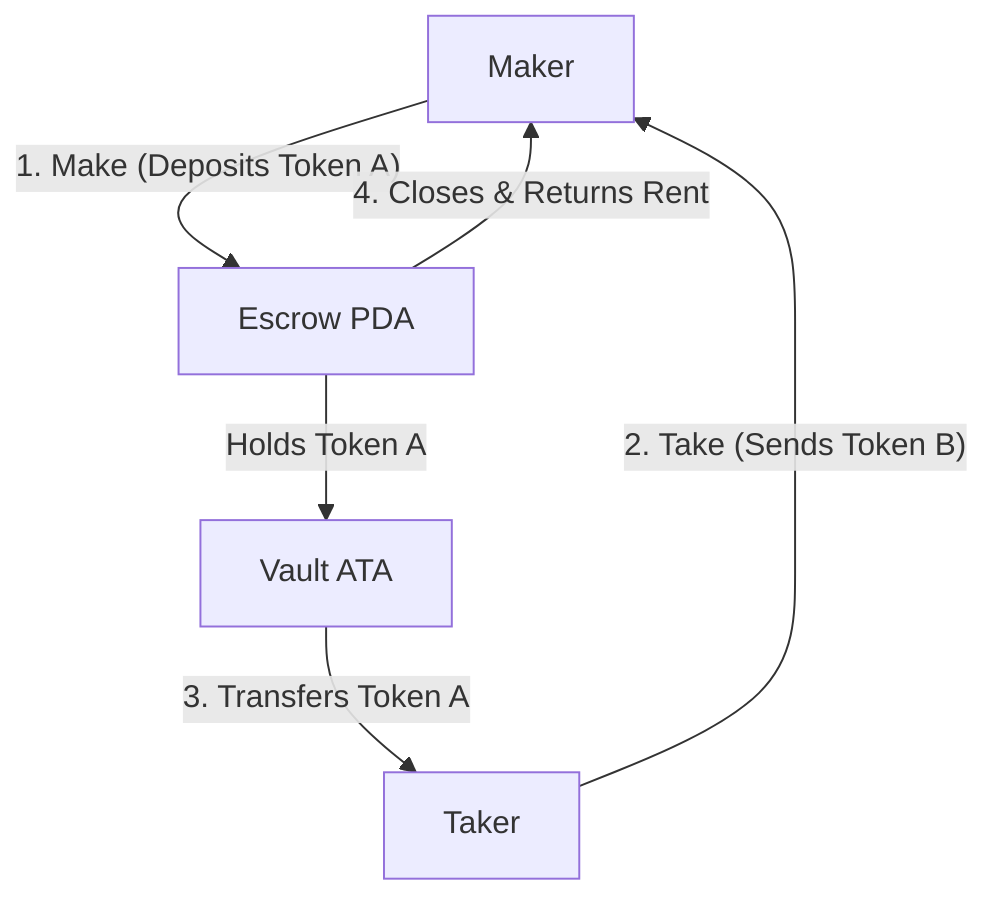

# Pinocchio Escrow Program

A highly-optimized, zero-dependency Solana escrow program built using [Pinocchio](https://github.com/aeyakovenko/pinocchio) (or `pinocchio` crate), designed to demonstrate secure token exchange with extremely low compute unit (CU) footprint and minimal program size.

## Why Pinocchio?

Unlike traditional Solana programs written with the `solana-program` SDK or the Anchor framework, **Pinocchio** is an experimental, ultra-lightweight library. It:
- Bypasses the heavy transitive dependencies of `solana-program` (like `serde`, `borsh`, etc.).
- Avoids large allocator and serialization overhead, making it ideal for high-throughput, low-latency, and cost-efficient program execution.
- Employs raw pointer manipulation and direct layout mapping for maximum performance.

---

## Architecture & Flow

The escrow program facilitates a trustless, peer-to-peer exchange of two distinct token mints: **Token A** (offered by the Maker) and **Token B** (requested by the Maker from a Taker).



### Escrow State Layout

The escrow state is stored in a PDA using a custom C-representation struct:

| Field | Type | Size (Bytes) | Description |
|---|---|---|---|
| `maker` | `[u8; 32]` / `Address` | 32 | The public key of the creator (Maker). |
| `mint_a` | `[u8; 32]` / `Address` | 32 | The mint of the token offered by the Maker. |
| `mint_b` | `[u8; 32]` / `Address` | 32 | The mint of the token requested by the Maker. |
| `amount_to_receive` | `[u8; 8]` / `u64` | 8 | Amount of Token B the Maker wants. |
| `amount_to_give` | `[u8; 8]` / `u64` | 8 | Amount of Token A the Maker is giving. |
| `bump` | `u8` | 1 | PDA derivation bump seed. |

**Total State Size:** `113` bytes.

---

## Instructions

The program exposes three main entry point instructions:

### 1. `Make` (Discriminator: `0`)
Initializes the escrow agreement and locks the offered tokens in the vault.
- **Action**:
  1. Derives the Escrow PDA using `["escrow", maker_pubkey, bump]`.
  2. Creates and initializes the Escrow PDA account on-chain.
  3. Writes the `Escrow` state metadata.
  4. Creates the Vault Associated Token Account (ATA) owned by the Escrow PDA.
  5. Transfers `amount_to_give` of Token A from Maker's ATA into the Vault ATA.
- **Required Accounts**:
  - `[signer, writable]` Maker
  - `[readable]` Mint A
  - `[readable]` Mint B
  - `[writable]` Escrow Account PDA
  - `[writable]` Maker ATA A
  - `[writable]` Escrow ATA (Vault)
  - `[readable]` System Program
  - `[readable]` Token Program
  - `[readable]` Associated Token Program

### 2. `Take` (Discriminator: `1`)
Executes the swap. A Taker completes the trade by providing the requested tokens.
- **Action**:
  1. Verifies the escrow state details match the accounts provided.
  2. Transfers `amount_to_receive` of Token B from Taker's ATA directly to Maker's ATA.
  3. Transfers `amount_to_give` of Token A from the Vault ATA to Taker's ATA (signed by the Escrow PDA).
  4. Closes the Vault ATA, returning rent lamports to the Maker.
  5. Closes the Escrow PDA account, reclaiming all rent lamports to the Maker.
- **Required Accounts**:
  - `[signer, writable]` Taker
  - `[writable]` Maker
  - `[readable]` Mint A
  - `[readable]` Mint B
  - `[writable]` Escrow Account PDA
  - `[writable]` Taker ATA B (Token B source)
  - `[writable]` Taker ATA A (Token A destination)
  - `[writable]` Maker ATA B (Token B destination)
  - `[writable]` Escrow ATA (Vault)
  - `[readable]` System Program
  - `[readable]` Token Program

### 3. `Refund` (Discriminator: `2`)
Allows the Maker to cancel the escrow agreement before it's taken and reclaim their locked tokens.
- **Action**:
  1. Verifies the Maker matches the escrow creator.
  2. Transfers `amount_to_give` of Token A from the Vault ATA back to Maker's ATA.
  3. Closes the Vault ATA, returning rent to the Maker.
  4. Closes the Escrow PDA account, returning rent lamports to the Maker.
- **Required Accounts**:
  - `[signer, writable]` Maker
  - `[readable]` Mint A
  - `[writable]` Escrow Account PDA
  - `[writable]` Maker ATA A (Token A destination)
  - `[writable]` Escrow ATA (Vault)
  - `[readable]` System Program
  - `[readable]` Token Program

---

## Setup & Testing

### Prerequisites
Ensure you have the Rust compiler and the Solana tool suite installed.

### Build
Compile the program to the SBF target:
```bash
cargo build-sbf
```
*Note: This generates the compiled shared object binary `.so` file in `target/deploy/accel_p_escrow.so` which is used by the test suite.*

### Run Tests
The integration tests utilize the lightweight `LiteSVM` library to simulate transaction execution without running a local validator.

To run the unit and integration tests:
```bash
cargo test
```
