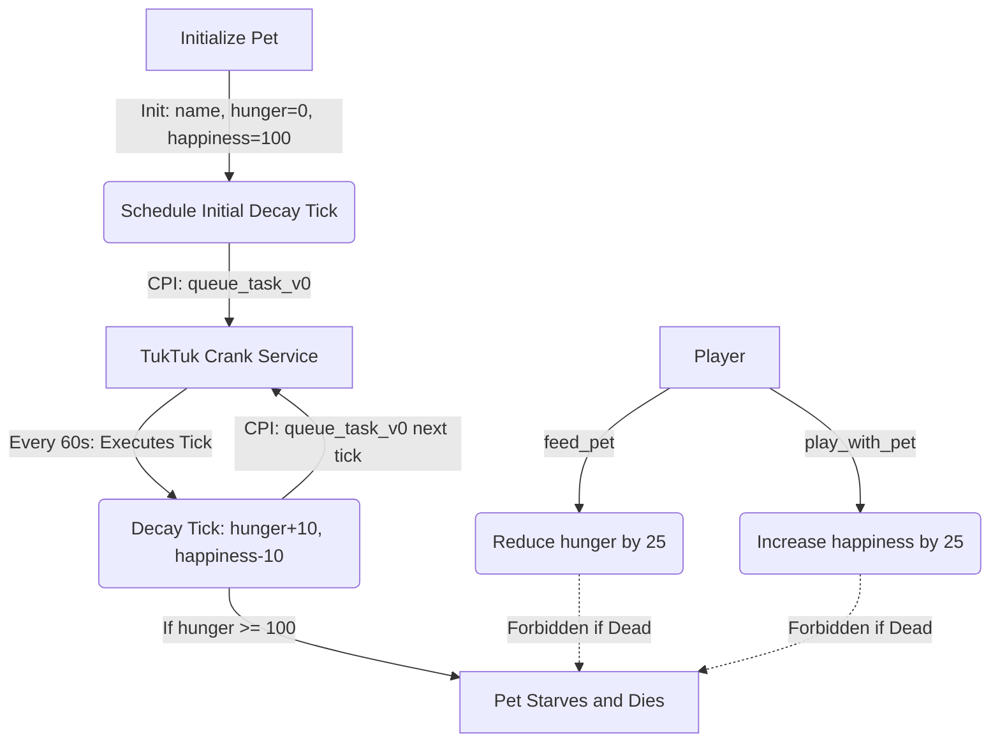

# TukTuk Tamagotchi 👾🚜

TukTuk Tamagotchi is an autonomous on-chain pet game built on Solana using the [Anchor Framework](https://www.anchor-lang.com/) and integrating with the [TukTuk Protocol](https://tuktuk.fun/) (a decentralized permissionless crank and scheduling service).

The game implements a fully decentralized game state loop: the pet's health decays over time via scheduled TukTuk crank tasks, and players must interact (feed or play) to manage the pet's stats and keep it alive.

---

## Game Mechanics & Flow



1. **Initialize Pet (`initialize`)**: Creates the `Pet` PDA and sets initial stats (hunger = 0, happiness = 100, is_alive = true).
2. **Kickstart Automation (`schedule_next_crank`)**: Schedules the first `decay_tick` task on TukTuk with a delayed trigger (e.g., 60 seconds in the future) via Cross-Program Invocation (CPI).
3. **Automated Decay (`increment_counter`)**: When a TukTuk cranker executes the queued task:
   * Pet's `hunger` increases by `10`.
   * Pet's `happiness` decreases by `10`.
   * If hunger reaches `100`, the pet is marked as dead (`is_alive = false`).
   * It recursively queues the next decay tick task (`task_id + 1`) to trigger in another 60 seconds.
4. **Player Interactions**:
   * **`feed_pet`**: Decreases hunger by 25 (clamped to 0).
   * **`play_with_pet`**: Increases happiness by 25 (clamped to 100).
   * Both instructions fail with a `PetIsDead` custom program error if the pet has starved.

---

## File Structure

* **[`programs/tuktuk-station/src/state.rs`](file:///Users/ekete/.gemini/antigravity/scratch/tuktuk-tamagotchi/programs/tuktuk-station/src/state.rs)**: Defines the `Pet` struct layout.
* **[`programs/tuktuk-station/src/instructions/initialize.rs`](file:///Users/ekete/.gemini/antigravity/scratch/tuktuk-tamagotchi/programs/tuktuk-station/src/instructions/initialize.rs)**: Initializes the pet's name, stats, and queue mapping.
* **[`programs/tuktuk-station/src/instructions/feed_pet.rs`](file:///Users/ekete/.gemini/antigravity/scratch/tuktuk-tamagotchi/programs/tuktuk-station/src/instructions/feed_pet.rs)**: Reduces pet hunger.
* **[`programs/tuktuk-station/src/instructions/play_with_pet.rs`](file:///Users/ekete/.gemini/antigravity/scratch/tuktuk-tamagotchi/programs/tuktuk-station/src/instructions/play_with_pet.rs)**: Increases pet happiness.
* **[`programs/tuktuk-station/src/instructions/schedule_next_crank.rs`](file:///Users/ekete/.gemini/antigravity/scratch/tuktuk-tamagotchi/programs/tuktuk-station/src/instructions/schedule_next_crank.rs)**: Schedules the first decay tick on TukTuk with a 60-second delay.
* **[`programs/tuktuk-station/src/instructions/increment_counter.rs`](file:///Users/ekete/.gemini/antigravity/scratch/tuktuk-tamagotchi/programs/tuktuk-station/src/instructions/increment_counter.rs)**: Standard decay tick execution and recursive scheduler.
* **[`programs/tuktuk-station/src/error.rs`](file:///Users/ekete/.gemini/antigravity/scratch/tuktuk-tamagotchi/programs/tuktuk-station/src/error.rs)**: Defines the custom `PetIsDead` error.

---

## Development & Testing

### Compilation

Build the program:

```bash
anchor build
```

### Running Tests

We use **LiteSVM** to test program state transitions in-process. Execute the test suite with stdout capture disabled:

```bash
cargo test -- --nocapture
```

The tests verify:
1. Pet initialization and default stats.
2. Feeding correctly reduces hunger.
3. Playing correctly increases happiness.
4. Attempting to feed a dead pet throws the correct `PetIsDead` custom error.
5. Delayed task scheduling via CPI calls.
